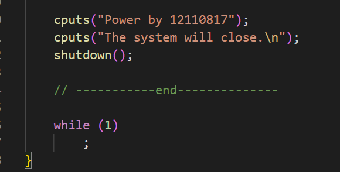
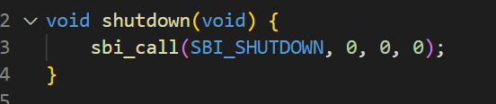
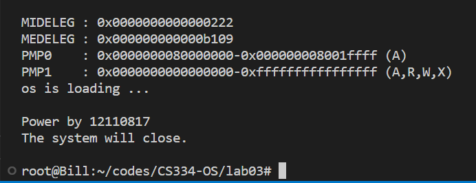

## 1. make qemu

```makefile
qemu-system-riscv64 \
	-machine virt \
	-nographic \
	-bios default \
	-device loader,file=bin/ucore.bin,addr=0x80200000
```

- `qemu-system-riscv64`: The command to start the QEMU emulator for a RISC-V 64-bit system.
- `-machine virt`: Set the machine type to `virt`, which is `RISC-V VirtIO board`

- `-nographic`: Disable the graphical output of the emulator and redirects the console output to the terminal. 
- `-bios default`: Use the default BIOS of OpenSBI.
- `-device loader,file=bin/ucore.bin,addr=0x80200000`: This option add a device to the virtual machine that loads a binary file into memory at the specified address. In this case, the binary file `bin/ucore.bin` will be loaded into memory at address `0x80200000`.


## 2. kernal.ld

- `SECTIONS`: It describe the memory layout of the output file, followed by a series of symbol assignments and output section descriptions enclosed in curly braces.
- `. = BASE_ADDRESS`: Load the kernel at this address: "." means the current address.
- `.text : { *(...) }`: Obtain the. text section of all input files and place it in a contiguous address space. The first address is determined by the **BASE_ADDRESS** symbol in the previous command. 

- `PROVIDE(etext = .)`: Define the **etext** symbol to the current address.
- `.rodate : {...}`: Define the read only data. Obtain the  .rodata section of all input files and place it in a contiguous address space.
- `. = ALIGN(0x1000)`: Adjust the address for the data segment to the next page.


## 3. memset(edata, 0, end - edata)

This command clears the memory space of **.bss** segment in kernal.ld. `BSS` Stands for Block Started by Symbol, whose space stores the global variables and static variables. `edata` is the beginning address of .bss segment. `end` is the end address of .bss segment.

## 4. cputs()

- `cputs()` receives a pointer of a string. 
- `cputs()` calls `cputch()` recurrently and sends a char to `cputch()` .
- `cputs()` calls `cons_putc()`.
-  `cons_putc()` calls `sbi_console_putchar((unsigned char)c);`

- `sbi_console_putchar()` calls `sbi_call(SBI_CONSOLE_PUTCHAR, ch, 0, 0)` and send the command type `SBI_CONSOLE_PUTCHAR` to sbi_call.
- `sbi_call` use **inline assembly** to encapsulate and execute `ecall` operations. In this case, it prints a char in terminal.


## 5. shutdown()










